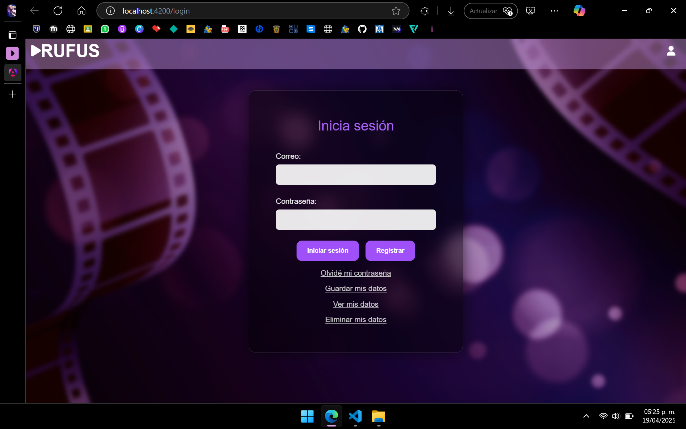
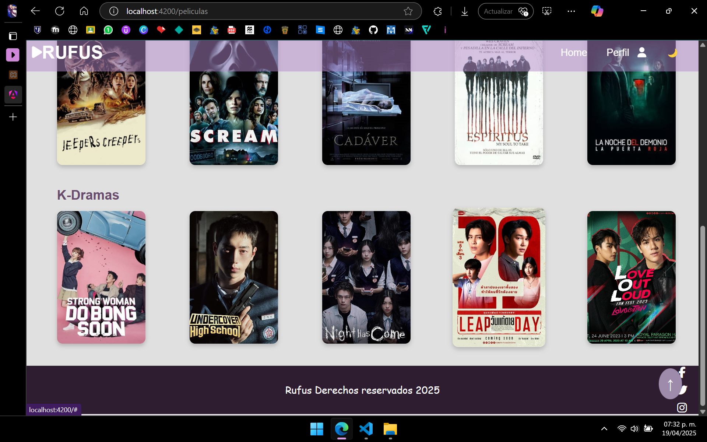
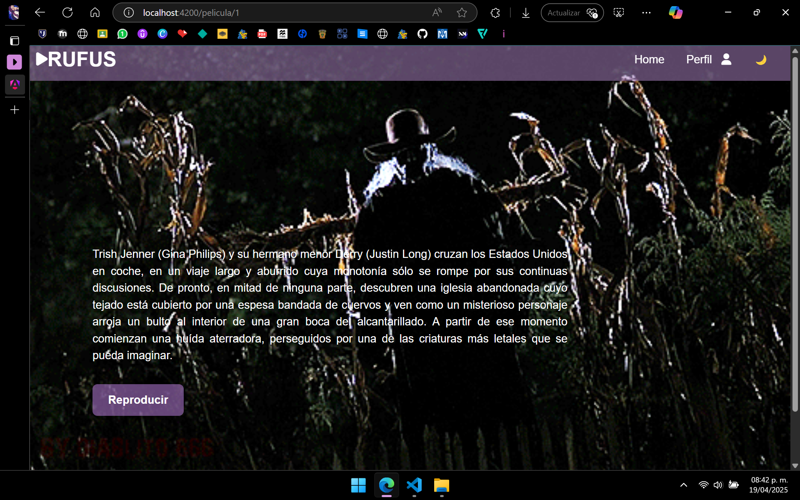
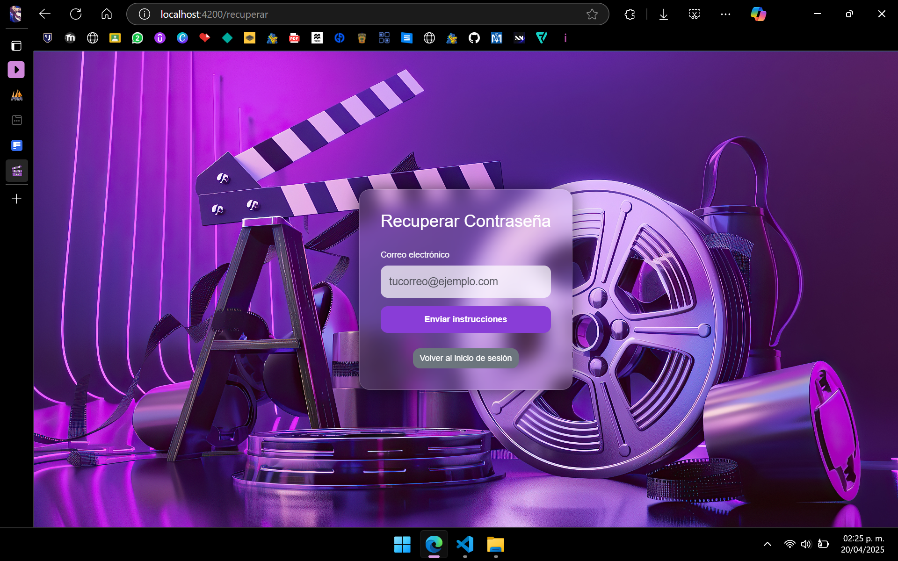
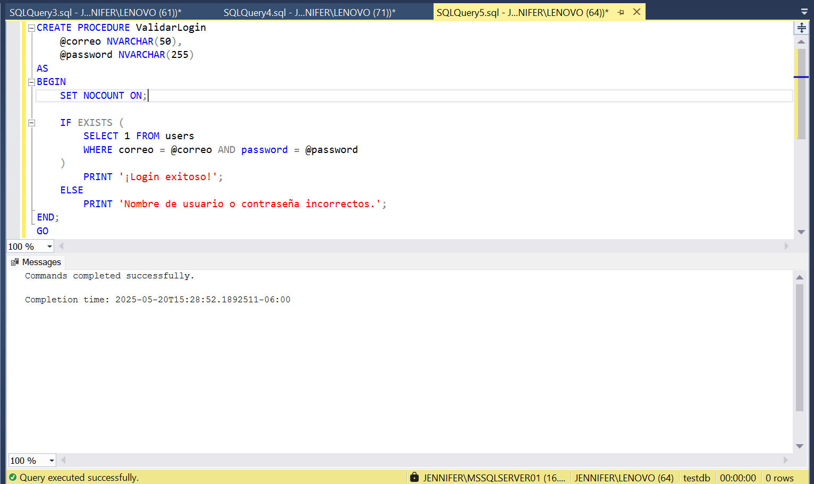
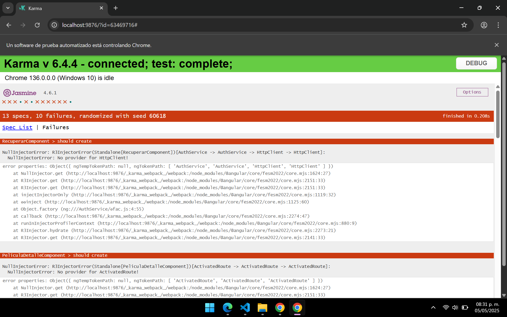
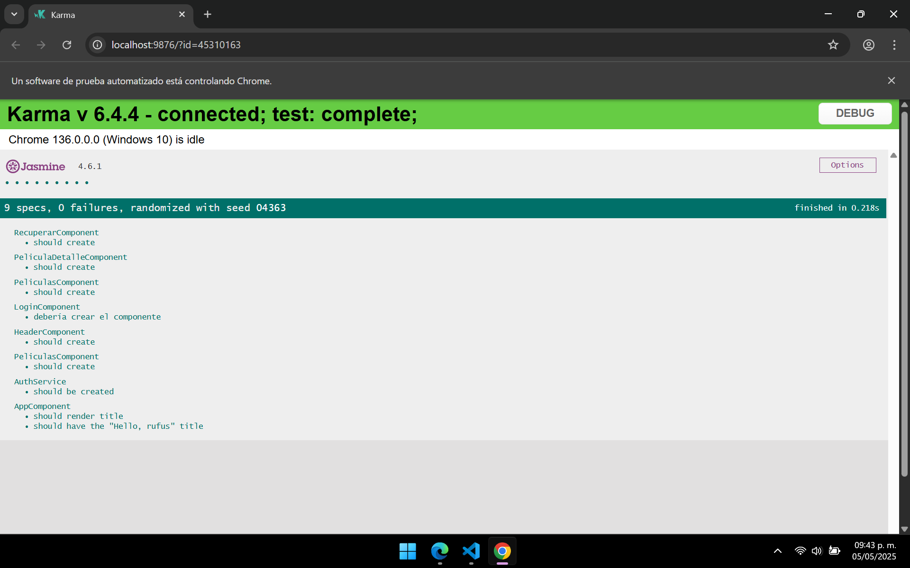

# RUFUS 🎬

## Descripción

**RUFUS** es una plataforma de películas y series enfocada en los géneros de terror, suspenso y K-dramas. En la parte superior del menú se encuentran los botones de ***Home*** (para volver al inicio) y ***Perfil*** (para cerrar sesión).

La primera pantalla es el inicio de sesión (`login.html`), donde debes ingresar un correo y contraseña. Si no tienes una cuenta, puedes registrarte desde el botón correspondiente, que te redireccionará a un formulario para completar tu registro.

Una vez iniciada la sesión, se accede a la vista principal (`index.html`). En esta se muestra como portada la serie o película más reciente, la cual se actualiza semanalmente. Más abajo encontrarás un catálogo de películas de terror seguido por una sección de K-dramas.

Al seleccionar una película (por ejemplo, *Jeepers Creepers*), se redirecciona a una vista con una breve descripción y un botón para reproducirla.


## Objetivo 🎯

El objetivo principal de esta plataforma es compartir películas de terror y series del género K-drama, al mismo tiempo que se implementan nuevas herramientas de desarrollo, como Angular y el uso de TypeScript en lugar de JavaScript.

En este cuarto sprint uno de los objetivos es la implementación del `Lazy Loading` en donde hace la carga más lenta de las imagenes y recursos de la misma página, hace que no se use o consuma elementos sin antes no haberlas visto o ingresado a tal apartado en el que está.


## Imágenes 📷











## Instrucciones ⚙️

1. Clona este repositorio utilizando GitHub Desktop o desde la terminal.
2. Ubícalo en la siguiente ruta (ejemplo para XAMPP):
```
├── Disco Local(C:)          
│   └── xampp
│        └── htdocs
```

3. Abre una terminal en la carpeta del proyecto y ejecuta:

```bash
ng serve
```
Esto compilará el proyecto y estará disponible en http://localhost:4200.
También se puede ejecutar:
```bash
ng serve --open
```

## Dependencias / Bibliotecas 📦

**Información del entorno Angular**
+ Angular CLI: 19.2.8

+ Angular: 19.2.7

+ Node.js: 22.13.0

+ npm: 10.9.2

+ OS: Windows (win32 x64)

**Dependencias principales**

- @angular/core | 19.2.7                    #Corazón de Angular (componentes, inyección de dependencias, etc.)

- @angular/router | 19.2.7                  #Navegación y rutas entre vistas/componentes

- @angular/forms | 19.2.7                   #Manejo de formularios reactivos y template-driven

- @angular/platform-browser | 19.2.7        #Soporte para que Angular funcione en el navegador

- @angular/platform-server | 19.2.7         #Para renderizado en el servidor (SSR)

- @angular/cli | 19.2.8        #Línea de comandos de Angular para generar componentes, correr el servidor, etc

- @angular-devkit/build-angular | 19.2.8    #Encargado de compilar y construir la app Angular

- @angular/ssr | 19.2.8   #Integración específica para aplicaciones Server Side Rendering (Angular Universal)

- rxjs | 7.8.2      #Programación reactiva (usado por Angular para manejar datos asincrónicos con observables)

- typescript | 5.7.3                       #Lenguaje con tipado estático usado por Angular

- zone.js | 0.15.0                     #Permite a Angular detectar cambios automáticamente (change detection)

## Descripción del desarrollo 🛠️

Para la primera parte con la que se comienza es el `login.component.html`, en este realicé algunos cambios, aún la idea no es clara del todo, pero pretendo o me gustaría agregar algunas opciones para que el usuario pueda visualizar, guardar sus datos al ingresar a la plataforma, así como también pueda eliminarlos cuando vea necesario.

Para este archivo únicamente agregué la estructura y formulario que debe de llevar, la imagen en los estilos `login.component.css`, lo que vendría siendo como el menú y lo principal, va en el apartado de `index.html` tomando los valores globales para todos los demás archivos.
Algo que vi necesario hacer y muy util fue, que para hacer o poner el menú en ambos apartados que utilizo, fue el hacer un archivo de nombre `header`, en este ponerlo e usarlo para ambos, el de `peliculas` y `peliculas-detalle`, para no repetir código y solo implementar una extensión.

Para el apartado de mi `footer` utilicé mis estilos y detalles desde el `style.css` global, para que se tome directamente.

### Login HTML
`login.component.html`
```html
<!-- Fondo con barra de navegación y formulario -->
<div class="img-login">
  
  <!-- Barra de navegación -->
  <ul class="nav">
    <li class="nav-item nav-left">
      <i class="fas fa-play"></i>
    </li>

    <li class="nav-item nav-title">
      <a routerLink="/login" class="nav-link-title">RUFUS</a>
    </li>

    <li class="nav-item nav-right">
      <i class="fas fa-user"></i>
    </li>
  </ul>

  <!-- Contenedor de login -->
  <div class="login-container">
    <h1>Inicia sesión</h1>

    <form [formGroup]="loginForm" (ngSubmit)="onSubmit()">
      <div class="input-wrapper">
        <label for="email">Correo:</label>
        <input id="email" formControlName="email" type="email" />
        <i *ngIf="email?.invalid && email?.touched" class="fas fa-exclamation-circle error-icon"></i>
        <i *ngIf="email?.valid && email?.touched" class="fas fa-check-circle success-icon"></i>
      </div>

      <div class="error" *ngIf="email?.invalid && email?.touched">
        Ingresa un correo válido.
      </div>

      <div class="input-wrapper">
        <label for="password">Contraseña:</label>
        <input id="password" formControlName="password" type="password" />
        <i *ngIf="password?.invalid && password?.touched" class="fas fa-exclamation-circle error-icon"></i>
        <i *ngIf="password?.valid && password?.touched" class="fas fa-check-circle success-icon"></i>
      </div>

      <div class="error" *ngIf="password?.invalid && password?.touched">
        La contraseña es obligatoria.
      </div>

      <div class="main-buttons">
        <button type="submit" class="btn btn-primary">Iniciar sesión</button>
        <button type="button" class="btn btn-primary" (click)="goToRegister()">Registrar</button>
      </div>

      <!-- Opciones secundarias -->
      <div class="secondary-options">
        <button type="button" class="option-link" (click)="goToForgotPassword()">Olvidé mi contraseña</button>
        <button type="button" class="option-link" (click)="guardarDatos()">Guardar mis datos</button>
        <button type="button" class="option-link" (click)="verDatosGuardados()">Ver mis datos</button>
        <button type="button" class="option-link" (click)="eliminarDatosGuardados()">Eliminar mis datos</button>
      </div>      
    </form>
  </div>
</div>
```

### Header
`header.component.html` Este se usa para el menú de `peliculas` y `pelicula-detalle`, así como también tiene las redirecciones.
```html
<!-- Barra de navegación -->
<ul class="nav">
  <li class="nav-item nav-left">
    <i class="fas fa-play"></i>
  </li>

  <li class="nav-item nav-title">
    <a [routerLink]="['/peliculas']" class="nav-link-title">RUFUS</a>
  </li>

  <li class="nav-item nav-right">
    <a [routerLink]="['/peliculas']" class="nav-link">Home</a>
  </li>

  <li class="nav-item nav-right perfil-dropdown">
    <span id="perfilBtn">Perfil <i class="fas fa-user"></i></span>
    <div id="menuPerfil" class="menu-perfil">
      <a [routerLink]="['/login']">Cerrar sesión</a>
    </div>
  </li>      

  <li class="nav-item nav-right">
    <button id="darkToggle" class="nav-link">🌙</button>
  </li>  
</ul>
```
### Peliculas
`peliculas.component.html` Esta es mi estructura donde se visualizan las imagenes.
```html
<section class="categoria">
  <h2>Terror</h2>
  <div class="grid-categorias">
    <a [routerLink]="['/pelicula', 1]">
      
    </a>
    <a href="#"></a>
    <a href="#"></a>
    <a href="#"></a>
    <a href="#"></a>
  </div>
</section>

<section class="categoria">
<h2>K-Dramas</h2>
  <div class="grid-categorias">
      <a href="#"></a>
      <a href="#"></a>
      <a href="#"></a>
      <a href="#"></a>
      <a href="#"></a>
  </div>
</section>
```

### Login PHP
Como parte del código del `login.php` donde consulta los datos desde la base de datos.
```PHP
$consulta = $conexion->prepare("SELECT * FROM users WHERE email = ? AND password = ?");
$consulta->bind_param("ss", $email, $password);
$consulta->execute();
$resultado = $consulta->get_result();
```
También agregué la un apartado de recuperar, este tanto en angular como en mi backend(`recuperar.component.html, recuperar.php`), en dado caso de olvidar la contraseña, así como la implementación de la idea de enviar al correo electronico mensaje de recuperación, pero por ahora solo será con la idea de mostrar un simple mensaje.


### Lazy Loaling
Se realizó la carga de los componentes para su implementación, esta fue definida mediante `loadComponent`. Este método se usó dentro de las rutas de la aplicación permitiendo que los componentes fuesen cargados solo cuando el usuario navegara en la ruta correspondiente.
Un claro ejemplo de su uso e implementación es en mi archivo con la ruta `app.routes.ts`.
```ts
{
  path: 'login',
  loadComponent: () =>
    import('./components/login/login.component').then(m => m.LoginComponent)
},
```

Lo que se hace aquí es que carga el archivo de `login.component.js` cuando el usuario navega a la ruta `/login`.

Tomando en cuenta esta implementación se agregó el archivo de `home` y `about`. Estos para dar la bienvenida de la página principal y mostrar información sobre la aplicación o del mismo proyecto en sí.

### Backend 💾


### Base de Datos


## Estructura del proyecto
```
RUFUS/
├── rufus
|   ├── angular.json
|   ├── package.json
|   ├── tsconfig.json
|   ├── karma.conf.js
├── src/
│   ├── main.ts
│   ├── app/
│   │   ├── app.config.ts
│   │   ├── app.routes.ts
│   │   ├── about/
│   │   │   │   ├── about-routing.module.ts
│   │   │   │   ├── about.component.css
│   │   │   │   ├── about.component.html
│   │   │   │   ├── about.component.spec.ts
│   │   │   │   ├── about.component.ts
│   │   │   │   ├── about.module.ts
│   │   ├── home/
│   │   │   │   ├── home.component.css
│   │   │   │   ├── home.component.html
│   │   │   │   ├── home.component.spec.ts
│   │   │   │   ├── home.component.ts
│   │   │   │   ├── home.module.ts
│   │   ├── components/
│   │   │   ├── header/
│   │   │   │   ├── header.component.ts
│   │   │   │   ├── header.component.html
│   │   │   │   └── header.component.css
│   │   │   ├── login/
│   │   │   │   ├── login.component.ts
│   │   │   │   ├── login.component.html
│   │   │   │   └── login.component.css
│   │   │   ├── peliculas/
│   │   │   │   ├── peliculas.component.ts
│   │   │   │   ├── peliculas.component.html
│   │   │   │   └── peliculas.component.css
│   │   │   └── pelicula-detalle/
│   │   │       ├── pelicula-detalle.component.ts
│   │   │       ├── pelicula-detalle.component.html
│   │   │       └── pelicula-detalle.component.css
│   └── assets/
│       ├── js/
│       │   └── custom.js
│       └── css/
│           └── styles.css
├── php/
│   ├── conexion.php
│   ├── login.php
│   └── recuperar.php
└── README.md
```

## Reporte Testing
Para la parte del testing, utilicé las herramientas que proporciona Angular testing, que junto con esta trabaja Jazmine que es un framework de comportamiento del usuario, este se encarga de testear bloques de código, y Karma que es un runner, una libreria o herramienta que se encarga de ejecutar las diferentes pruebas que nosotros le escribamos a Jazmin.

Para poder ejecutar mi testing en mi máquina fue necesario ingresar la siguiente línea de código.
` npm install --save-dev karma karma-cli karma-jasmine karma-chrome-launcher karma-coverage jasmine-core karma-jasmine-html-reporter @angular-devkit/build-angular
`

Tuve que crear un nuevo archivo con el nombre de `karma.conf.js`, en este se encarga de llevar a cabo el testing, abriendolo desde un navegador que le asignemos.

## Problemas

Como problema que considero que presenté en esta ocasión y una de las más grandes ha sido la migración a Angular, ya que ha sido algo totalmente nuevo para mi. El entender su estructura y su funcionamiento a primera instancia ha sido complicada, sin embargo con el paso del uso he logrado entenderlo un pcoco mejor, me parece mucho más facil a su vez el acomodo de todo, aunque esto negere más archivos que a su vez es confuso el saber donde poner cada cosa, pero me agrada que sean independientes uno de otro, cada html, sus estilos y su js.
En el apartado del inicio de sesion (`login.html`) es donde quizá me ha costado un poco, en cuentión de los botones, ya que me agradó la idea de añadir otras opcioens, sin embargo el acomodo que le daré aún no lo tengo del todo claro, quizá haga unos cambios más adelante.
Otro de los problemas que presenté, es como son tantas carpetas, tuve problema de poner la dirección para las imagenes.

Con respecto a problemas que continuo teniendo siguen siendo en de las imagenes, ya que olvido bien las direcciones, o incluso el jalar los estilos y que estos estan divididos, pero poco a poco se va haciendo más sencillo entenderlo.

En esta ocasión uno de los problemas que más grandes me ha dado, es en cuestión de mi navegador, ya que la herrmaienta de karma está dando problemas en parte con mi navegador, la parte de hacerlo ejecutar o correr en mi navegador ha sido de lo más complicado.

Por ahora no he podido darle solución a mi problema presentado, ya que he tenido problemas con mi navegador, uso el de Edge, sin embargo aunque haya hecho los cambios y tal, el programa de karma insiste en abrir el navegador de Chrome, sin embargo ya lo instalé y todo, pero aún así se presentan problemas con la instalación de mi Chrome.
Tuve una breve solución, quizá no como se debería, pero al menos tuve la correción de los errores presentados.

En cuestión de la implementación de mi Lazy Loading, este si me causó un poco de problema, ya que en parte no estaba en uno del todo del Standload, y tuve que realizar varios cambios para su implementación correcta de la misma en el proyecto.

## Retrospectiva 

> _¿Qué hice bien?_ 
```
Creo que he entendido la manera de desarrollo, su ejecución y funcionamiento de cada una de las herramientas que tiene consigo y trabajan de la mano con Angular, lo que es Karma y Jazmin.
```
>_¿Qué no salió bien?_
```
Quizá el testing en sí, ya que no puedo desarrollar bien el testing por problemas con mi navegador que no encuentra la ruta de mi navegador,
```
>_¿Qué puedo hacer diferente?_
```
Dedicarle más tiempo, es cierto que en esta ocasión solo le he dedicado unos pocos días en comparación de los otros proyectos, me confié y sin embargo salió un problema que no consideré y me ha detenido a su ejecución correcta del proyecto.
```